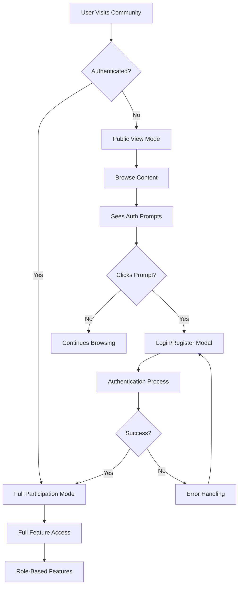

# Authentication-Aware Community Implementation

## Overview

This document outlines the implementation of authentication-aware community features for iPEC Coach Connect. The system provides seamless user experiences that gracefully transition between public viewing and authenticated participation.

## Architecture

### Core Components

#### AuthPrompt Component
**Location**: `/src/components/community/AuthPrompt.tsx`

Reusable authentication prompt component that displays contextual messages encouraging user authentication.

**Features**:
- Multiple visual styles (inline, card, banner, overlay)
- Context-aware messaging based on action type
- Mobile-responsive design
- Accessibility compliant
- Maintains page context after authentication

**Usage**:
```tsx
<AuthPrompt
  action="participate"
  style="inline"
  context="in this discussion"
  emphasizeSignUp={true}
/>
```

**Action Types**:
- `participate` - General community participation
- `reply` - Replying to discussions
- `create` - Creating new content
- `join` - Joining groups
- `rsvp` - RSVPing to events
- `like` - Liking/reacting to content
- `follow` - Following users
- `message` - Direct messaging
- `vote` - Voting on polls
- `save` - Bookmarking content

#### AuthAwareWrapper Components
**Location**: `/src/components/community/AuthAwareWrapper.tsx`

Collection of wrapper components providing authentication-aware functionality:

1. **AuthAwareWrapper** - Basic authenticated/unauthenticated content switching
2. **ConditionalAction** - Role and permission-based action rendering
3. **ProgressiveContent** - Progressive disclosure based on authentication state
4. **withAuthAwareness** - HOC for authentication-aware components

### Enhanced Community Components

#### EnhancedCommunity
**Location**: `/src/pages/community/EnhancedCommunity.tsx`

Main community hub with authentication-aware features:
- **Public Users**: Can view all content with inline authentication prompts
- **Authenticated Users**: Full interaction capabilities with role-based features
- **Progressive Disclosure**: Additional content revealed for authenticated users

#### EnhancedDiscussionDetails
**Location**: `/src/pages/community/EnhancedDiscussionDetails.tsx`

Discussion detail page with authentication-aware participation:
- **Public Viewing**: Full discussion content visible
- **Authentication Prompts**: Inline prompts for likes, replies, follows
- **Role-Based Actions**: Edit/delete for content owners and moderators
- **Reply Threading**: Full participation for authenticated users

#### EnhancedEventDetails
**Location**: `/src/pages/community/EnhancedEventDetails.tsx`

Event details with authentication-aware registration:
- **Public Information**: Event details, agenda, speakers visible to all
- **Authentication Prompts**: RSVP and calendar integration require authentication
- **Attendee Lists**: Progressive disclosure of attendee information
- **Host Controls**: Role-based event management features

## Authentication States

### Non-Authenticated Users

**Capabilities**:
- ✅ View all discussions, groups, and events
- ✅ Read complete content and comments
- ✅ See public attendee counts and basic info
- ✅ Browse community topics and trends
- ✅ Share content via social media
- ✅ View public profile information

**Limitations with Prompts**:
- ❌ Create discussions → "Sign in to start discussions"
- ❌ Reply to posts → "Sign in to join the conversation"
- ❌ Like/react to content → "Sign in to show appreciation"
- ❌ Join groups → "Sign in to join this group"
- ❌ RSVP to events → "Sign in to reserve your spot"
- ❌ Follow users → "Sign in to stay connected"
- ❌ Save bookmarks → "Sign in to save for later"

### Authenticated Users

**Additional Capabilities**:
- ✅ Full participation in discussions
- ✅ Create and reply to posts
- ✅ Like, react, and bookmark content
- ✅ Join and leave groups
- ✅ RSVP to events and add to calendar
- ✅ Follow other community members
- ✅ Access full attendee and member lists
- ✅ Direct messaging capabilities
- ✅ Personalized content recommendations

### Role-Based Features

#### Client Role
- Standard community participation
- Join groups and events
- Create discussions and replies

#### Coach Role
- All client capabilities
- Create and host groups
- Host events and workshops
- Content moderation in owned groups
- Enhanced profile visibility

#### Admin/Moderator Role
- All previous capabilities
- System-wide content moderation
- User management features
- Event and group management
- Access to analytics and reporting

## User Experience Flow

### Authentication Journey



### Interaction Patterns

#### Inline Prompts
- Subtle, non-intrusive
- Appear contextually near actions
- Don't interrupt browsing flow
- Clear value proposition

#### Progressive Disclosure
- Basic content visible to all
- Enhanced features for authenticated users
- Role-specific capabilities revealed appropriately
- Seamless transition between states

## Implementation Patterns

### Authentication Checking
```tsx
const { isAuthenticated, canPerformAction } = useAuthAwareActions();

// Simple authentication check
if (!isAuthenticated) {
  return <AuthPrompt action="participate" />;
}

// Role-based action check
if (!canPerformAction(['admin', 'moderator'], ['content:moderate'])) {
  return null; // Hide action
}
```

### Conditional Rendering
```tsx
<ConditionalAction
  authAction="join"
  requiredRoles={['client', 'coach']}
  replaceWithPrompt={true}
>
  <Button onClick={joinGroup}>Join Group</Button>
</ConditionalAction>
```

### Progressive Content
```tsx
<ProgressiveContent
  publicContent={<BasicEventInfo />}
  authenticatedContent={<DetailedEventInfo />}
  roleBasedContent={[{
    roles: ['coach', 'admin'],
    content: <HostControls />
  }]}
/>
```

## SEO and Accessibility

### SEO Benefits
- **Public Content Visibility**: All content visible to search engines
- **Rich Metadata**: Proper meta tags for social sharing
- **Structured Data**: Schema markup for events and discussions
- **Clean URLs**: SEO-friendly routing structure

### Accessibility Features
- **Screen Reader Support**: Proper ARIA labels and descriptions
- **Keyboard Navigation**: Full keyboard accessibility
- **Color Contrast**: WCAG 2.1 AA compliant
- **Focus Management**: Logical tab order
- **Alternative Text**: Descriptive alt text for images

### Mobile Optimization
- **Touch Targets**: Minimum 44px touch targets
- **Responsive Design**: Fluid layouts for all screen sizes
- **Gesture Support**: Touch gestures where appropriate
- **Performance**: Optimized loading and interactions

## Testing Strategy

### Unit Tests
**Location**: `/src/components/community/__tests__/`

#### AuthPrompt Tests
- Renders different styles correctly
- Handles navigation properly
- Supports all action types
- Accessibility compliance
- Keyboard navigation support

#### AuthAwareWrapper Tests
- Conditional rendering logic
- Role and permission checking
- Progressive disclosure
- HOC functionality

### Integration Tests
- Authentication state transitions
- Role-based feature access
- Cross-component interactions
- Navigation flow testing

### E2E Tests
```javascript
// Example E2E test scenarios
describe('Community Authentication Flow', () => {
  it('allows public browsing and prompts for participation', async () => {
    // Visit community as unauthenticated user
    // Verify content visibility
    // Click on interactive element
    // Verify authentication prompt appears
    // Complete authentication flow
    // Verify feature access granted
  });

  it('provides role-based feature access', async () => {
    // Authenticate as different roles
    // Verify appropriate features available
    // Test permission boundaries
  });
});
```

### Accessibility Testing
- Screen reader compatibility
- Keyboard-only navigation
- Color contrast validation
- WCAG 2.1 compliance

### Performance Testing
- Page load times with/without authentication
- Component rendering performance
- Memory usage optimization
- Bundle size impact

## Security Considerations

### Client-Side Security
- No sensitive data in client-side code
- Proper authentication state management
- Secure token storage and handling
- CSRF protection for forms

### Permission Validation
- Server-side permission verification
- Role-based access control
- Input validation and sanitization
- Rate limiting for actions

## Performance Optimizations

### Code Splitting
```tsx
const EnhancedCommunity = lazy(() => import('./EnhancedCommunity'));
const EnhancedDiscussionDetails = lazy(() => import('./EnhancedDiscussionDetails'));
```

### Caching Strategies
- Authentication state caching
- Component-level memoization
- API response caching
- Image optimization

### Bundle Optimization
- Tree shaking for unused code
- Dynamic imports for routes
- Optimized dependencies
- Compression and minification

## Deployment Considerations

### Environment Configuration
- Authentication service endpoints
- Feature flag management
- Analytics integration
- Error monitoring setup

### Migration Strategy
1. **Phase 1**: Deploy new components alongside existing ones
2. **Phase 2**: Gradually replace existing components
3. **Phase 3**: Remove legacy components
4. **Phase 4**: Optimize and refine based on usage data

## Monitoring and Analytics

### Key Metrics
- Authentication conversion rates
- Feature adoption by user type
- User engagement patterns
- Performance metrics

### A/B Testing Opportunities
- Authentication prompt styles
- Call-to-action messaging
- Feature placement and visibility
- Onboarding flow optimization

## Future Enhancements

### Planned Features
1. **Social Login Integration** - Additional OAuth providers
2. **Smart Recommendations** - AI-powered content suggestions
3. **Advanced Moderation** - ML-based content filtering
4. **Community Gamification** - Points, badges, and achievements
5. **Enhanced Mobile App** - Native mobile application
6. **Real-time Features** - Live discussions and notifications

### Technical Improvements
1. **Performance Monitoring** - Real user monitoring
2. **Advanced Caching** - Redis-based caching layer
3. **CDN Integration** - Global content delivery
4. **Progressive Web App** - Offline functionality
5. **Advanced Analytics** - User behavior tracking

This implementation provides a comprehensive, scalable foundation for authentication-aware community features that enhance user experience while maintaining security and performance standards.